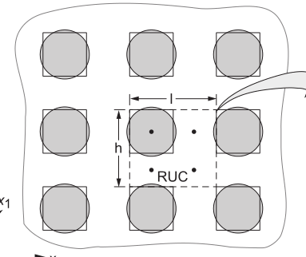

## AE 760AA: Micromechanics and multiscale modeling
Lecture 15 - Method of Cells

Dr. Nicholas Smith

Wichita State University, Department of Aerospace Engineering

April 3, 2019

----
## schedule

- Apr 3 - Method of Cells
- Apr 8 - Damage Theory
- Apr 10 - Damage Theory
- Apr 15 - Dislocation Theory

----
## outline

<!-- vim-markdown-toc GFM -->

* method of cells
* results

<!-- vim-markdown-toc -->

---
# method of cells

----
## method of cells

-   The methodology referred to as the “method of cells” can refer to a few different variations of the same general theory
-   Some terminology the author uses are “doubly periodic” and “triply periodic”

----
## doubly periodic

----
## triply periodic

----
## periodicity

-   While both models are actually triply periodic, a continuous fiber cross-section can be modeled in 2D, while discontinuous fibers need to be modeled in 3D
-   We will follow the derivation for the 2D model

----
## 2D problems

-   For 2D problems (i.e. continuous fibers) the Repeating Unit Cell is divided up into 4 sub-cells

----
## 2D problems

-   As a first-order approximation (which should be sufficient to determine stiffness properties) we assume a displacement function which varies linearly from the center of the cell
    
$$u\_i = w\_i(x) + \\bar{x\_2} \\phi\_i + \\bar{x\_3} \\psi\_i$$

-   where *w**i* are the displacements at the centroid and *ψ* and *ϕ* relate the local displacement to the distance from the centroid
-   Note that due to the linearity of this equation, the equilibrium equations will be automatically satisfied

----
## continuity

-   Displacements must be continuous across adjacent cells
-   In the method of cells, this continuity is enforced in the average sense, thus the integral over adjacent boundaries of displacement components must be equal and opposite
-   Due to this method of enforcing continuity, there is no actual shape implied in the RUC, so although we have drawn it as a rectangle, it could be any shape

$$\\int\_{-l/2}^{l/2} u\_i^{1\\gamma}|\_{\\bar{x}\_2=-h/2}d\\bar{x}\_3 = \\int\_{-l/2}^{l/2} u\_i^{2\\gamma}|\_{\\bar{x}\_2=h/2}d\\bar{x}\_3$$

$$\\int\_{-h/2}^{l/2} u\_i^{\\beta 1}|\_{\\bar{x}\_3=l/2}d\\bar{x}\_2 = \\int\_{-h/2}^{h/2} u\_i^{\\beta 2}|\_{\\bar{x}\_3=-l/2}d\\bar{x}\_2$$

----
## continuity

-   The next steps are to
-   Perform the integration
-   Enforce periodicty over the entire RUC (instead of the sub-cells)
-   Represent functions of *x* (*w**i*) with a Taylor Series approximation

----
## sub-cell strain field

$$\\begin{aligned}
  \\epsilon\_{11} &= \\frac{\\partial}{\\partial x\_1} w\_1\\\\
  \\epsilon\_{22} &= \\phi\_2\\\\
  \\epsilon\_{33} &= \\psi\_3\\\\
  2\\epsilon\_{12} &= \\phi\_1 + \\frac{\\partial}{\\partial x\_1} w\_2\\\\
  2\\epsilon\_{13} &= \\psi\_1 + \\frac{\\partial}{\\partial x\_1} w\_3\\\\
  2\\epsilon\_{23} &= \\phi\_3 + \\psi\_2
\\end{aligned}$$

----
## effective stiffness

-   To find the effective stiffness we still need to solve for *ϕ**i* and *ψ**i* in terms of the constituent properties
-   By enforcing continuity of tractions along the cell and sub-cell boundaries we obtain enough equations to solve

$$\\begin{bmatrix}
  0 & a\_1 & a\_2 & a\_3\\\\
  a\_4 & 0 & a\_5 & a\_6\\\\
  a\_7 & a\_8 & a\_9 & 0\\\\
  a\_{10} & a\_{11} & 0 & a\_{12}
\\end{bmatrix} \\begin{bmatrix}
  \\phi\_2^{11}\\\\
  \\phi\_2^{22}\\\\
  \\psi\_3^{11}\\\\
  \\psi\_3^{22}
\\end{bmatrix} = \\begin{bmatrix}
  J\_1\\\\ J\_2 \\\\ J\_3 \\\\ J\_4
\\end{bmatrix}$$

----
## local field equations

-   The method of cells can also be used to relate local strains to macro strains
-   Similar to the Eshelby and Mori-Tanaka discussion, we will use a strain concentration tensor to relate these fields

$$\\epsilon = A \\bar{\\epsilon}$$

----
## strain concentration tensor

-   The general form of the strain concentratio tensor from the method of cells is

$$A = \\begin{bmatrix}
  1 & 0 & 0 & 0 & 0 & 0\\\\
  A\_{21} & A\_{22} & A\_{23} & 0 & 0 & 0\\\\
  A\_{31} & A\_{32} & A\_{33} & 0 & 0 & 0\\\\
  0 & 0 & 0 & A\_{44} & 0 & 0\\\\
  0 & 0 & 0 & 0 & A\_{55} & 0\\\\
  0 & 0 & 0 & 0 & 0 & A\_{66}
\\end{bmatrix}$$

----
## imperfect bonding

-   Up to now, we have assumed a perfect bond between constituents
-   This is often not the case, and similar to other methods, we can incorporate the effects of imperfect bonding by considering an interphase between the fiber and matrix
-   In this model, we can modify the continuity requirement at the interface between fiber and matrix

----
## generalized method of cells

-   For 3D problems (i.e. discontinuous composites) the same procedure can be used as described above, but in three dimensions
-   The generalized method of cells provides the framework for subdividing an RUC into many smaller sub-cells
-   This begins to look very similar to finite elements, but there are a few key differences
    -   it automatically ensures periodicity
    -   displacement continuity is enforced in only an average sense (as opposed to point-wise)
    -   solution is not mesh-dependent (no shape functions)

----
## high fidelity method of cells

-   The authors have made further modifications to the generalized method of cells
-   Most analytic models (Mori-Tanaka) as well as the Method of Cells predict no shear coupling
-   In most cases, while there is some shear coupling it is negligible
-   In short fiber composites and woven composites, however, the shear coupling effects are not negligible
-   The High Fidelity Method of Cells addresses this issue
-   Assumes second-order displacement field, equilibrium is not automatically satisfied, is required to be satisfied in an average sense in each sub-cell
-   Even higher order displacement fields can be considered for functionally graded composites

----
## functionally graded composites

---
# results

----
## continuous composite

----
## results

----
## mises stress

----
## tensile stress

----
## shear stress

