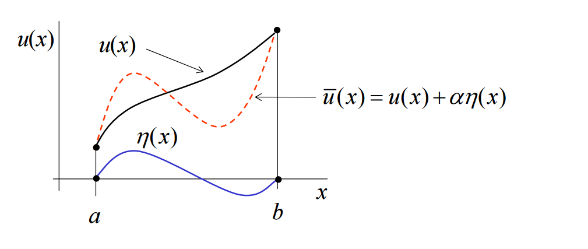
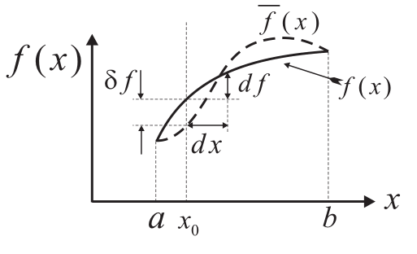

## AE 760AA: Micromechanics and multiscale modeling
Lecture 8 - Variational Calculus

Dr. Nicholas Smith

Wichita State University, Department of Aerospace Engineering

10 February 2022

----
## schedule

-   10 Feb - Variational Calculus (HW2 Due)
-   15 Feb - Variational Calculus
-   17 Feb - Boundary Conditions (HW3 Due)
-   22 Feb - Project Descriptions

----
## outline

<!-- TOC START min:1 max:1 link:false update:true -->
- lagrange multipliers
- calculus of variations

<!-- TOC END -->

---
# lagrange multipliers

----
## differential and variational statements

-   A differential statement includes a set of governing differential equations established inside a domain and a set of boundary conditions to be satisfied along the boundaries
-   A variational statement is to find stationary conditions for an integral with unknown functions in the integrand

----
## variational statements

-   Variational statements are advantageous in the following aspects
    -   Clear physical meaning, invariant to coordinate system
    -   Can provide more realistic descriptions than differential statements (concentrated loads)
    -   More easily suited to solving problems numerically or approximately
    -   Can be more systematic and consistent than building a set of differential equations

----
## stationary problems

-   If the function `$F(u_1)$` is defined on a domain, then at `$\frac{dF}{du_1}=1$` it is considered to be stationary
-   This stationary point could be a minimum, maximum, or saddle point
-   We use the second derivative to determine which of these it is: >0 for a minimum, <0 for a maximum and =0 for a saddle point

----
## stationary points

-   For a function of *n* variables, `$F(u_n)$` the stationary points are

`$$\frac{\partial F}{\partial u_i} = 0$$`
     for all values of *i*
-   and to determine the type of stationary point we use

`$$\sum_{i,j=1,n} \frac {\partial^2 F}{\partial u_i \partial u_j}$$`

----
## lagrange multipliers

-   Let us now consider a function of several variables, but the variables are subject to a constraint
 
`$$ f(u_1, u_2, ... ) = 0$$` 

-   Algebraically, we could use each provided constraint equation to reduce the number of variables
-   For large problems, it can be cumbersome or impossible to eliminate some variables
-   The Lagrange Multiplier method is an alternative, systematic approach

----
## lagrange multiplier

-   For a constrained problem at a stationary point we will have

`$$dF = \frac{\partial F}{\partial u_1} du_1 + ... + \frac{\partial F}{\partial u_n} du_n = 0$$`

-   The relationship between *du**i* can be found by differentiating the constraint

`$$df = \frac{\partial f}{\partial u_1} du_1 + ... + \frac{\partial f}{\partial u_n} du_n = 0$$`

----
## lagrange multiplier 

-   We can combine these two equations using a Lagrange Multiplier
 
`$$\frac{\partial F}{\partial u_1} du_1 + ... + \frac{\partial F}{\partial u_n} du_n + \lambda \left[\frac{\partial f}{\partial u_1} du_1 + ... + \frac{\partial f}{\partial u_n} du_n \right]$$`

-   We can re-group terms as

`$$\sum_{i=1}^n \left[\frac{\partial F}{\partial u_i} + \lambda \frac{\partial f}{\partial u_i} \right]du_i = 0$$`

----
## lagrange multiplier

-   The Lagrange Multiplier, `$\lambda$` is an arbitrary function of `$u_i$`
-   We can choose the Lagrange Multiplier such that

`$$\frac{\partial F}{\partial u_n} + \lambda \frac{\partial f}{\partial u_n}  = 0$$`

-   Which now leaves

`$$\frac{\partial F}{\partial u_i} + \lambda \frac{\partial f}{\partial u_i} = 0 \qquad i=1,2,...,n-1$$`

-   We now define a new function `$F^* = F + \lambda f$`

----
## lagrange multiplier

-   This converts a constrained problem in *n* variables to an unconstrained problem in *n* + 1 variables
-   Notice that while the stationary values of `$F^*$` will be the same as the stationary values to `$F$`, they will not necessarily correspond
-   For example, a minimum in `$F^*$` might be a maximum in `$F$`
-   This provides a systematic method for solving problems with any number of variables and constraints, and is also well-posed for numeric solutions

----
## example

-   Design a box with given surface area such that the volume is maximized
-   The box has no cover along one of the surfaces (open-face box)
-   This gives the surface area as `$A = xy + 2yz + 2xz = C$`
-   [worked example](https://colab.research.google.com/drive/1FwPoZyTFqZnGFyHpBhRj2PCqdtDACpNA?usp=sharing)

---
# calculus of variations

----
## functional

-   A functional of some unknown function `$y(x)$` is defined as
 
`$$ I = I[y(x)]$$`

-   A functional depends on all values of `$y(x)$` over some interval
-   We will often use the form
 
`$$I[y] = \int_a^b F(x,y(x),\dot{y}(x))dx$$`

----
## bernoulli

-   The original problem that motivated study of variational calculus
-   Bernoulli 1696
-   Design a chute between two points, A and B
-   such that a particle sliding without friction under its own weight
-   travels from A to B in the shortest time

----
## variational statement

-   To solve Bernoulli's problem we denote the arc length as *s*, speed as

`$$v = \frac{ds}{dt}$$`

-   And we can find the total time as
 
`$$t = \int_A^B \frac{ds}{v}$$`

----
## variational statement

-   The arc length *s* can be found from

`$$ds = \sqrt{dx^2 + dy^2}$$`

-   Since `$y=y(x)$` we can write `$dy = \dot{y} dx$`
-   We can now re-write *ds* as

`$$ds = \sqrt{1 + \dot{y}^2}dx$$`

----
## variational statement

-   From the conservation of energy we can also say that

`$$\frac{1}{2} m v^2 = m g y$$`

-   Such that

`$$v = \sqrt{2 g y}$$`

-   We now need to find some function *y*(*x*) which minimizes the integral

`$$t = \int_0^a \frac{\sqrt{1 + \dot{y}^2}}{\sqrt{2 g y}}dx$$`

----
## euler lagrange

-   Now we develop a method for finding *y*(*x*)
-   Consider the functional

`$$ I[y] = \int_{x_0}^{x_1} F(x,y,\dot{y})dx$$`

-   Where *y*(*x*) is subject to boundary conditions

`$$ y(x_0) = y_0 $$`
`$$ y(x_1) = y_1 $$`

----
## euler lagrange

-   We assume that there is some solution, *y*(*x*) for which *I* is stationary
-   We also assume that *y*(*x*) is continuous and differentiable in the problem domain
-   Let us now choose some trial function

`$$\bar{y}(x) = y(x) + \alpha \eta(x)$$`

-   Where `$\eta(x)$` is some arbitrary continuous function which vanishes at the boundaries

----
## euler lagrange

----
## euler lagrange

-   We can take the derivative of `$\bar{y}$` to find

`$$\dot{\bar{y}} = \dot{y}(x) + \alpha \dot{\eta}(x)$$`

-   This now gives
 
`$$I[\alpha] = \int_{x_0}^{x_1} F(x,\bar{y},\dot{\bar{y}})dx = \int_{x_0}^{x_1} F(x,y(x) + \alpha \eta(x),\dot{y}(x) + \alpha \dot{\eta}(x))dx$$`

-   Once *y*(*x*) and `$\eta(x)$` are chosen, *I* is a function of `$\alpha$`

----
## euler lagrange

-   We find the stationary function by letting `$\frac{dI}{d \alpha} = 0$`

`$$\frac{dI}{d \alpha} = \int_{x_0}^{x_1} \frac{\partial F}{\partial \alpha} dx =
  \int_{x_0}^{x_1} \left ( \frac{\partial F}{\partial \bar{y}}\frac{\partial \bar{y}}{\partial \alpha}  +
\frac{\partial F}{\partial \dot{\bar{y}}}\frac{\partial \dot{\bar{y}}}{\partial \alpha}\right )dx$$`
  
-   This simplifies to

`$$\int_{x_0}^{x_1} \left ( \frac{\partial F}{\partial \bar{y}}\eta  +
\frac{\partial F}{\partial \dot{\bar{y}}}\dot{\eta}\right )dx$$`

----
## euler lagrange

-   Now we know that *I* will be stationary when `$\alpha = 0$` in which case `$\bar{y}=y$` therefore we can write

`$$\int_{x_0}^{x_1} \left ( \frac{\partial F}{\partial y}\eta  +
\frac{\partial F}{\partial \dot{y}}\dot{\eta}\right )dx = 0$$`
  
-   And now we perform integration by parts on the second term

----
## integration by parts

-   Recall that

`$$\int u dv = uv - \int v du$$`

-   We choose

`$$\begin{aligned}
  u &= \frac{\partial F}{\partial \dot{y}}\\
  du &= \frac{d}{dx} \left( \frac{\partial F}{\partial y} \right)\\
  v &= \eta(x)\\
  dv &= \dot{\eta} dx
\end{aligned}$$`

----
## integration by parts

-   This gives (for the second term)

`$$\int_{x_0}^{x_1} \frac{\partial F}{\partial \dot{y}}\dot{\eta} dx = \frac{\partial F}{\partial \dot{y}}\eta |_{x_0}^{x_1} - \int_{x_0}^{x_1} \frac{d}{dx} \left( \frac{\partial F}{\partial y} \right) \eta(x)$$`

-   Combining with the original equation and simplifying gives
 
`$$\int_{x_0}^{x_1} \left [ \frac{\partial F}{\partial y} - \frac{d}{dx} \left( \frac{\partial F}{\partial y} \right) \right ]\eta dx + \frac{\partial F}{\partial \dot{y}}\eta |_{x_0}^{x_1} = 0$$`

----
## euler lagrange

-   We already know that `$\eta|_{x_0}^{x_1}=0$`, so we only need concern ourselves with the terms inside the integral
-   Since this must be true for any arbitrary function, $\eta$, we can say that

`$$\frac{\partial F}{\partial y} - \frac{d}{dx} \left( \frac{\partial F}{\partial y} \right) = 0$$`

-   This is known as the Euler-Lagrange equation
-   A solution to the Euler-Lagrange equation is called an extremal, and an extremal which satisfies the boundary conditions is called a stationary function

----
## variations

-   In variational calculus, we define the first variation as

`$$\delta y = \bar{y} - y$$`

-   Note: while the variation follows many of the same rules as differentiation, it does not correspond to any slope, since $\eta$ is completely arbitrary

----
## variations

----
## variations

-   Variational laws are analogous to differentiation

`$$\begin{aligned}
  \delta (F_1 F_2) &= F_1 \delta F_2 + \delta F_1 F_2\\
  \delta \left(\frac{F_1}{F_2} \right) &= \frac{F_2 \delta F_1 - F_1 \delta F_2}{F_2^2}
\end{aligned}$$`

-   The variation and derivative are commutative

`$$\frac{d}{dx} (\delta u) = \delta \left(\frac{du}{dx}\right)$$`

-   Similarly, the variation is commutative with the integral

`$$\delta \int F dx = \int \delta F dx$$`

----
## variations

-   We can also take the variation of a functional

`$$\Delta F = F(x,y + \alpha \eta, \dot{y} + \alpha \dot{\eta}) - F(x,y,\dot{y})$$`

-   Expanding this function via a Taylor series gives

`$$\Delta F = \left [ F(x,y,\dot{y}) + \left( \delta y \frac{\partial F}{\partial y} + \delta \dot{y} \frac{\partial F}{\partial \dot{y}} + ... \right) \right]- F(x,y,\dot{y})$$`

-   And thus we call the variation of *F*

`$$\delta F = \frac{\partial F}{\partial y} \delta y + \frac{\partial F}{\partial \dot{y}} \delta \dot{y} + \epsilon_1$$`

-   Where `$\epsilon_1$` are terms of higher order than `$\sqrt{(\delta y)^2 + (\delta \dot{y})^2}$` and are neglected in the first variation

----
## variations

-   We can use variational notation to find the Euler-Lagrange equation

`$$I[y] = \int_{x_0}^{x_1} F(x,y,\dot{y})dx$$`

-   and taking the variation

`$$\delta I = \int_{x_0}^{x_1} \left[  \frac{\partial F}{\partial y} \delta y + \frac{\partial F}{\partial \dot{y}} \delta \dot{y}\right]dx = 0$$`

----
## variations

-   Using integration by parts on the second term, as before, we find

`$$\delta I = \int_{x_0}^{x_1} \left[  \frac{\partial F}{\partial y} - \frac{d}{dx}\left(\frac{\partial F}{\partial \dot{y}}\right) \right]\delta y dx = 0$$`

-   Since `$\delta y (x_0) = \delta y (x_1) = 0$`
-   Since this must be true for any arbitrary variation, we have

`$$\frac{\partial F}{\partial y} - \frac{d}{dx}\left(\frac{\partial F}{\partial \dot{y}}\right)$$`

----
## variations

-   If the functional, *F*, does not depend on *x* explicitly (i.e. the only *x* dependence comes from *y*(*x*)) then we can say

`$$\frac{d}{dx}\left( F - \dot{y} \frac{\partial F}{\partial \dot{y}}\right) = 0$$`

-   or, similarly

`$$F - \dot{y} \frac{\partial F}{\partial \dot{y}} = C$$`

----
## brachistochrone 

-   If we return now to Bernoulli's problem, we had found

`$$t = \int_0^a \frac{\sqrt{1 + \dot{y}^2}}{\sqrt{2 g y}}dx$$`

-   Since this does not depend on *x* explicitly, we can use the simpler form of the Euler-Lagrange equation.

`$$F = \frac{\sqrt{1 + \dot{y}^2}}{\sqrt{2 g y}}$$`

-   with

`$$F - \dot{y} \frac{\partial F}{\partial \dot{y}} = C$$`

----
## brachistochrone

-   Computing the partial derivative we find

`$$\frac{\partial F}{\partial \dot{y}} = \frac{\dot{y}}{\sqrt{2 g y}\sqrt{1 + \dot{y}^2}}$$`

-   Which gives in the Euler-Lagrange equation

`$$\frac{\sqrt{1 + \dot{y}^2}}{\sqrt{2 g y}} - \frac{\dot{y}^2}{\sqrt{2 g y}\sqrt{1 + \dot{y}^2}} = C$$`

----
## brachistochrone 

-   Simplifying gives

`$$\frac{1}{\sqrt{2 g y}\sqrt{1 + \dot{y}^2}} = C$$`

-   We can square both sides and lump constants together

`$$y(1+\dot{y}^2) = \frac{1}{2gc^2} = c_1$$`

-   And solving for $\dot{y}$, taking only the positive solution

`$$\dot{y} = \frac{\sqrt{c_1-y}}{\sqrt{y}}$$`

----
## brachistochrone 

-   The Brachistochrone problem can be solved using parametric equations

`$$\begin{aligned}
  x &= k^2 (\theta - \sin\theta)\\
  y &= k^2 (1-\cos\theta)
\end{aligned}$$`

----
## example

-   We can also use variational calculus to prove that the shortest distance between to points is a straight line
-   The distance along a curve is given by

`$$L = \int_a^b ds$$`

-   Where `$ds = \sqrt{dx^2 + dy^2} = \sqrt{1+ \dot{y}^2}dx$` 
-   So we can find the minimum of the functional

`$$I[y] = \int_a^b \sqrt{1+ \dot{y}^2}dx$$`

----
## group problems

-   Find the Euler-Lagrange equation for

`$$I[y] = \int y\sqrt{1+\dot{y}^2} dx$$`

-   Find the Euler-Lagrange equation for

`$$I[y] = \int [\dot{y}^2 + y^2 + 2xy] dx$$`

----
## next class

-   Boundary conditions
-   Multi-variate variational calculus
-   Approximate solutions
-   Variational Asymptotic Method
