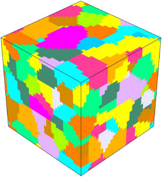
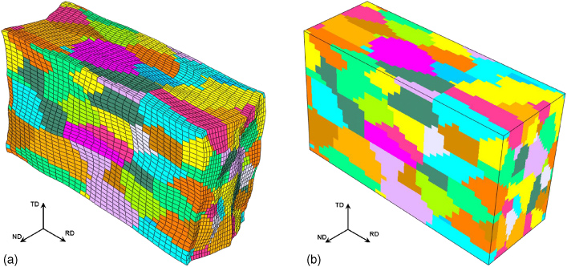
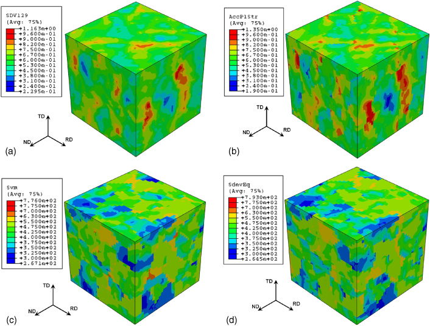

## AE 760AA: Micromechanics and multiscale modeling
Lecture 14 - Fourier Analysis

Dr. Nicholas Smith

Wichita State University, Department of Aerospace Engineering

24 March 2022

----
## schedule

-   24 Mar - Fourier Analysis, HW 5 Due, Project Abstract Due
-   29 Mar - Method of Cells
-   31 Mar - Workday
-   5 Apr - Damage Theory

----
## outline

<!-- vim-markdown-toc GFM -->

* fourier methods
* theoretical basis
* installation

<!-- vim-markdown-toc -->

---
# fourier methods

----
## motivation

-   Fourier transforms are often used to represent periodic data
-   If we have a periodic microstructure, we can formulate the problem in Fourier space
-   There are many Fast Fourier Transform (FFT) algorithms available to compute discrete problems very quickly

----
## current implementations

-   There are a few different codes (that I am aware of) that use Fourier techniques for modeling micromechanics
-   CraFT (I have linked this in the past) [link](http://craft.lma.cnrs-mrs.fr/spip/) (original FFT for elasticity program)
-   [Morphhom](http://cmm.ensmp.fr/morphhom/) (another french group)
-   [MASSIF](http://www.icmr.ucsb.edu/programs/3DWorkshop/Rollett-FFT-modeling-method.pdf) (modifications made by group at Los Alamos)

----
## uses

-   While many Micromechanics tools have been developed around specific applications (such as composites), FFT-based algorithms attempt to be somewhat more general
-   Used for polycrystalline materials (metal alloys), grain boundaries, fatigue crack initiation, dislocation stress fields, microcracks, graded microstructures, coatings, etc.
-   Requires periodic structure and BC’s
-   This means it can be used to characterize a material, but cannot solve most structural problems
-   Uses image-based inputs (pixels/voxels) which can directly relate to experiments (serial sectioning, 3D X-ray/CT scan), but are a little more difficult to develop conceptually

----
## validation

-   Prakash and Lebensohn validated the FFT method against FEM for a rolling simulation.
-   [link](http://iopscience.iop.org/article/10.1088/0965-0393/17/6/064010/meta)

----
## RVE

----
## deformed

----
## comparison

---
# theoretical basis

----
## references

-   Textbook chapter 11 (pp 419-431) discusses Fourier methods for periodic structural homogenization
-   There are also many papers on the subject, [link](https://arxiv.org/pdf/1412.8398.pdf) (Fourier-based schemes for computing the mechanical response of composites with accurate local fields by Francois Willot) is a good review

----
## linear elasticity

-   All Fourier schemes begin with the standard equations of linear elasticity

`$$\begin{aligned}
  \sigma_{ij}(x) &= C_{ijkl} \epsilon_{kl}(x)\\
  \sigma_{ij,j}(x) &=0\\
  \epsilon_{ij}(x) &= \frac{1}{2} (u_{i,j}(x) + u_{j,i}(x))
\end{aligned}$$`

-   While we have listed material properties as functions of *x*, we usually have only 2-3 phases of material, and thus these functions will be piecewise, simply differentiating between the phases

----
## lippmann-schwinger equations

-   Fourier Methds are based on the Lippmann-Schwinger equations where we define the polarization field as

`$$\tau_{ij} = \sigma_{ij}(x)-C_{ijkl}^0 \epsilon_{kl}(x)$$`

-   We also use the Green operator, which is given (in the Fourier space) as

`$$ G_{ijkl}(q) = q_i \left[ q_m C_{mjkn^0 q_n}\right]^{-1} q_l $$`

-   and the strain field can be expressed as

`$$\epsilon_{ij}(x) = \bar{\epsilon}_{ij} - \int_{x^\prime} d^d x^\prime G_{ijkl} (x^\prime - x)\tau_{kl} (x^\prime)$$`

-   where `$q_i$` are Fourier wave vectors

----
## direct scheme

-   These equations are generally solved iteratively, with different assumptions used to arrive at the solution
-   The “direct” scheme solves the problem iteratively using
    
`$$\begin{aligned}
  \epsilon^{k=0} &= \bar{\epsilon}\\
  \epsilon^{k+1} &= \bar{\epsilon} - G \* (\sigma-C^0:\epsilon^k)
\end{aligned}$$`

-   Where each iteration is solved in the Fourier space (where the convolution integral is an algebraic product)
-   The convergence of this method is quite slow when there is high contrast between the two phases

----
## accelerated schemes

-   There are many methods to accelerate the convergence for high contrast materials
-   One is referred to as the “acclerated scheme” another is known as the “augmented lagrangian”
-   In the accelerated scheme the strain is calculated as

`$$\epsilon^{k+1} = \epsilon^k + 2(C+C^0)^{-1}:C^0:\[\bar{\epsilon}-\epsilon^k-G\*(C:\epsilon^k-C^0:\epsilon^k)\]$$`

-   `$C^0$` is a reference stiffness, and while it is arbitrary, the choice of `$C^0$` does affect the convergence, and for isotropic materials the optimal `$C^0$` is given by
    
`$$k^0 = \sqrt{k^1 k^2} \qquad \mu^0 = \sqrt{\mu^1\mu^2}$$`

---
# installation

----
## installation

-   For now, CraFT is the only FFT program I have tried, although I have contacted other authors so we may possibly be able to use those in the future as well
-   It must be compiled from source on Linux, I will provide information on how to do this on a Windows machine
-   First, you need to emulate linux, I use [virtualbox](https://www.virtualbox.org/wiki/Downloads) but there are other virtual machines
-   Next, you need to download and install a Linux distribution to install in Virtualbox (or your virtual machine), I used [ubuntu](https://www.ubuntu.com/download)
-   There are many tutorials on the internet if you wish to use a different Linux distribution, you may have to modify some commands slightly

----
## compiling

-   Next you need to obtain and compile the source for CraFT. I have the source code and will share it with you if you do not want to contact the authors directly
-   To build the source code, first you need to obtain some standard libraries, as well as the FFT library used in CraFT
-   In ubuntu type into the command line `sudo apt-get install build-essential gfortran libfftw3-dev`
-   Navigate to the directory with CraFT and unpack it using `tar xvfz craft-1.0.12g.tgz`
-   Navigate to the CraFT directory `cd craft-1.0.12g`
-   Type `make` and the program will compile

----
## post processing

-   CraFT includes some basic pre-processing, but no post-processing
-   It saves output files in the vtk format, there are multiple programs that can view these files
-   I used paraview which can be installed using `sudo apt-get install paraview`

