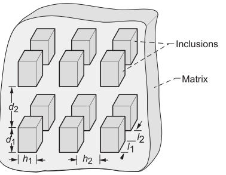
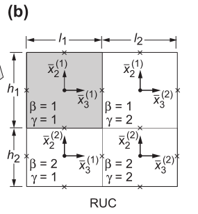
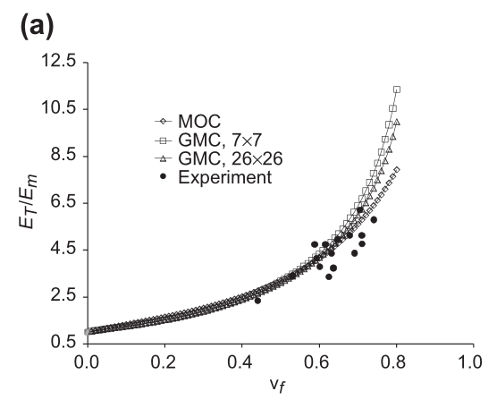

## AE 760AA: Micromechanics and multiscale modeling
Lecture 15 - Method of Cells

Dr. Nicholas Smith

Wichita State University, Department of Aerospace Engineering

31 March 2022

----
## schedule

-   31 Mar - Method of Cells
-   5 Apr - Workday
-   7 Apr - Damage Theory, HW 6 Due

----
## outline

<!-- vim-markdown-toc GFM -->

* method of cells
* results

<!-- vim-markdown-toc -->

---
# method of cells

----
## method of cells

-   The methodology referred to as the “method of cells” can refer to a few different variations of the same general theory
-   Some terminology the author uses are “doubly periodic” and “triply periodic”

----
## doubly periodic

----
## triply periodic

----
## periodicity

-   While both models are actually triply periodic, a continuous fiber cross-section can be modeled in 2D, while discontinuous fibers need to be modeled in 3D
-   We will follow the derivation for the 2D model

----
## 2D problems

-   For 2D problems (i.e. continuous fibers) the Repeating Unit Cell is divided up into 4 sub-cells

----
## 2D problems

-   As a first-order approximation (which should be sufficient to determine stiffness properties) we assume a displacement function which varies linearly from the center of the cell
    
`$$u_i = w_i(x) + \bar{x_2} \phi_i + \bar{x_3} \psi_i$$`

-   where `$w_i$` are the displacements at the centroid and `$\psi$` and `$\phi$` relate the local displacement to the distance from the centroid
-   Note that due to the linearity of this equation, the equilibrium equations will be automatically satisfied

----
## continuity

-   Displacements must be continuous across adjacent cells
-   In the method of cells, this continuity is enforced in the average sense, thus the integral over adjacent boundaries of displacement components must be equal and opposite
-   Due to this method of enforcing continuity, there is no actual shape implied in the RUC, so although we have drawn it as a rectangle, it could be any shape

`$$\int_{-l/2}^{l/2} u_i^{1\gamma}|_{\bar{x}_2=-h/2}d\bar{x}_3 = \int_{-l/2}^{l/2} u_i^{2\gamma}|_{\bar{x}_2=h/2}d\bar{x}_3$$`

`$$\int_{-h/2}^{l/2} u_i^{\beta 1}|_{\bar{x}_3=l/2}d\bar{x}_2 = \int_{-h/2}^{h/2} u_i^{\beta 2}|_{\bar{x}_3=-l/2}d\bar{x}_2$$`

----
## continuity

-   The next steps are to
-   Perform the integration
-   Enforce periodicity over the entire RUC (instead of the sub-cells)
-   Represent functions of *x* (`$w_i$`) with a Taylor Series approximation

----
## sub-cell strain field

`$$\begin{aligned}
  \epsilon_{11} &= \frac{\partial}{\partial x_1} w_1\\
  \epsilon_{22} &= \phi_2\\
  \epsilon_{33} &= \psi_3\\
  2\epsilon_{12} &= \phi_1 + \frac{\partial}{\partial x_1} w_2\\
  2\epsilon_{13} &= \psi_1 + \frac{\partial}{\partial x_1} w_3\\
  2\epsilon_{23} &= \phi_3 + \psi_2
\end{aligned}$$`

----
## effective stiffness

-   To find the effective stiffness we still need to solve for `$\phi_i$` and `$\psi_i$` in terms of the constituent properties
-   By enforcing continuity of tractions along the cell and sub-cell boundaries we obtain enough equations to solve

`$$\begin{bmatrix}
  0 & a_1 & a_2 & a_3\\
  a_4 & 0 & a_5 & a_6\\
  a_7 & a_8 & a_9 & 0\\
  a_{10} & a_{11} & 0 & a_{12}
\end{bmatrix} \begin{bmatrix}
  \phi_2^{11}\\
  \phi_2^{22}\\
  \psi_3^{11}\\
  \psi_3^{22}
\end{bmatrix} = \begin{bmatrix}
  J_1\\ J_2 \\ J_3 \\ J_4
\end{bmatrix}$$`

----
## local field equations

-   The method of cells can also be used to relate local strains to macro strains
-   Similar to the Eshelby and Mori-Tanaka discussion, we will use a strain concentration tensor to relate these fields

`$$\epsilon = A \bar{\epsilon}$$`

----
## strain concentration tensor

-   The general form of the strain concentration tensor from the method of cells is

`$$A = \begin{bmatrix}
  1 & 0 & 0 & 0 & 0 & 0\\
  A_{21} & A_{22} & A_{23} & 0 & 0 & 0\\
  A_{31} & A_{32} & A_{33} & 0 & 0 & 0\\
  0 & 0 & 0 & A_{44} & 0 & 0\\
  0 & 0 & 0 & 0 & A_{55} & 0\\
  0 & 0 & 0 & 0 & 0 & A_{66}
\end{bmatrix}$$`

----
## imperfect bonding

-   Up to now, we have assumed a perfect bond between constituents
-   This is often not the case, and similar to other methods, we can incorporate the effects of imperfect bonding by considering an interphase between the fiber and matrix
-   In this model, we can modify the continuity requirement at the interface between fiber and matrix

----
## generalized method of cells

-   For 3D problems (i.e. discontinuous composites) the same procedure can be used as described above, but in three dimensions
-   The generalized method of cells provides the framework for subdividing an RUC into many smaller sub-cells
-   This begins to look very similar to finite elements, but there are a few key differences
    -   it automatically ensures periodicity
    -   displacement continuity is enforced in only an average sense (as opposed to point-wise)
    -   solution is not mesh-dependent (no shape functions)

----
## high fidelity method of cells

-   The authors have made further modifications to the generalized method of cells
-   Most analytic models (Mori-Tanaka) as well as the Method of Cells predict no shear coupling
-   In most cases, while there is some shear coupling it is negligible
-   In short fiber composites and woven composites, however, the shear coupling effects are not negligible
-   The High Fidelity Method of Cells addresses this issue
-   Assumes second-order displacement field, equilibrium is not automatically satisfied, is required to be satisfied in an average sense in each sub-cell
-   Even higher order displacement fields can be considered for functionally graded composites

----
## functionally graded composites

---
# results

----
## continuous composite

----
## results

----
## mises stress

----
## tensile stress

----
## shear stress

