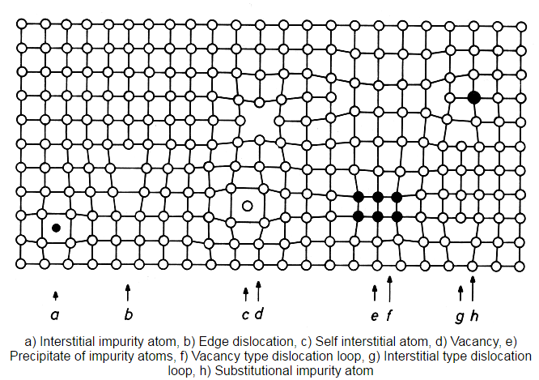
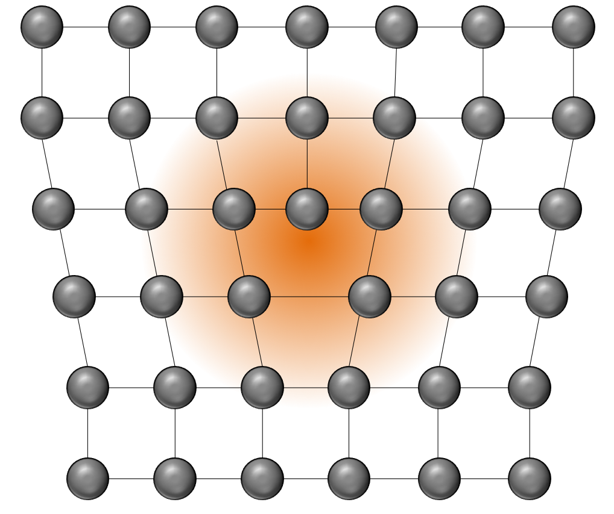
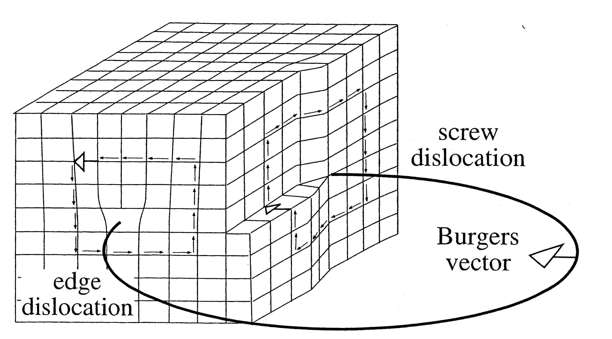
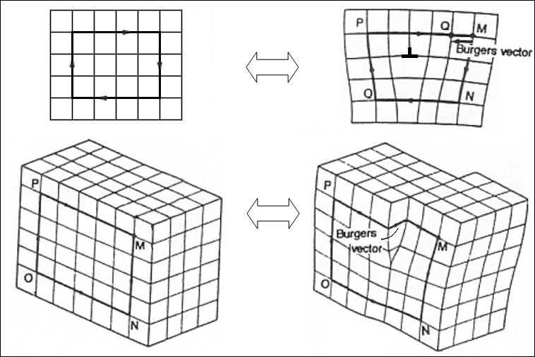

## AE 760AA: Micromechanics and multiscale modeling
Lecture 17 - Dislocation Theory

Dr. Nicholas Smith

Wichita State University, Department of Aerospace Engineering

14 April 2022

----
## schedule

- 14 Apr - Project Work Day
- (19 Apr) - Class Canceled
- Project Work Days

----
## outline

- dislocation theory
- dislocations in elasticity
- peach koehler force
- discrete dislocation dynamics

---
## dislocation theory

----
## damage vs. dislocation

-   We previously discussed a couple of damage models for materials
-   Void growth for ductile materials and micro-crack coalescence for brittle materials
-   Sometimes initial defects are neither voids nor micro-cracks
-   Dislocation theory attempts to model the effects of material discontinuities that are not cracks

----
##
material defects

-   There are many different types of material defects
-   0-dimensional defects
    -   Point defects (vacancies, interstitials)
    -   Impurity atoms
-   1-dimensional defects
    -   Dislocations
-   2-dimensional defects
    -   Stacking faults
    -   Grain boundaries
-   3-dimensional defects
    -   Voids
    -   Precipitates
    -   More complicated stacking faults

----
## material defects

----
## edge dislocations

----
## screw disolcation

----
## dislocation animations

-   [link](https://www.doitpoms.ac.uk/tlplib/dislocations/dislocation_motion.php)

----
## dislocation modeling

-   There are multiple ways of modeling discontinuities
-   Elasticity Theory - strong discontinuity in the displacement field
-   Peach-Koehler force
-   Discrete Dislocation Dynamics

---
# dislocations in linear elasticity

----
## screw dislocation

-   A Volterra dislocation is defined as a discontinuity of the displacement field over a line segment or surface
-   For screw dislocations, we consider the anti-plane problem with `$u_1 = 0$`, `$u_2 = 0$`, `$u_3 = w(x,y)$`
-   For an isotropic material, the only non-zero stress and strain components are

`$$\epsilon_{13} = \frac{1}{2}\frac{\partial w}{\partial x} \qquad \epsilon_{23} = \frac{1}{2}\frac{\partial w}{\partial y}$$`

and

`$$\sigma_{13} = \mu\frac{\partial w}{\partial x} \qquad \sigma_{23} = \mu\frac{\partial w}{\partial y}$$`

----
## screw dislocation

-   There is only one non-trivial equilibrium equation in this case

`$$\frac{\partial \sigma_{13}}{\partial x_1} + \frac{\partial \sigma_{23}}{\partial x_2} + \frac{\partial \sigma_{33}}{\partial x_3} = 0$$`

-   Which gives the governing equation

`$$\frac{\partial^2 w}{\partial x_1^2} + \frac{\partial^2 w}{\partial x_2^2} = \nabla^2 w =  0$$`

----
## screw dislocation

-   We can now convert the governing equation to polar coordinates

`$$\nabla^2 w = \left( \frac{\partial^2}{\partial^2 r} + \frac{1}{r}\frac{\partial}{\partial r} + \frac{1}{r^2}\frac{\partial^2}{\partial\theta^2}\right)w = 0$$`

-   Solving by the separation of variables with `$w(r,\theta) = f(r)g(\theta)$` we find two ODE’s

`$$\begin{aligned}
  \frac{d^2 f}{dr^2} + \frac{1}{r}\frac{df}{dr} - \frac{n^2 f}{r^2} &=0\\
  \frac{d^2g}{d\theta^2} + n^2g(\theta) &= 0
\end{aligned}$$`

----
## screw dislocation

-   The only admissible solution (with finite displacement at `$r = 0$`) to this is

`$$\begin{aligned}
  g(\theta) &= A + B\theta\\
  f(r) &= C \ln r + D
\end{aligned}$$`

-   We require `$C = 0$` since our solution must be valid at `$r = 0$`, and the jump condition means `$A = 0$`

-   Further, since `$\theta$` is a "constant" in `$r$`, we can combine the remaining constants, *B* and *D* to find

`$$w(r, \theta) = B \theta$$`

----
## screw dislocation

-   The jump condition requires that

`$$w(r, 2\pi) - w(r,\theta) = b$$`

-   Hence

`$$w(r,\theta) = \frac{\theta b}{2\pi}$$`

`$$w(x,y) = \frac{b}{2\pi} \arctan \left(\frac{y}{x}\right)$$`

----
## edge dislocation

-   We can use an Airy stress function in plane strain to solve the edge dislocation problem
-   See derivation in text pp. 303-305
-   Elasticity solutions are not often able to model dislocations very well
-   Some simple estimates (energy per unit length) are generally useful when applied within appropriate limits of the solution

---
# peach koehler force

----
## peach koehler force

-   If we consider a dislocation loop that undergoes some virtual displacement
-   We can find the virtual work done by this virtual displacement
-   The decrease in potential energy due to the virtual displacement is the external virtual work done along the dislocation loop

`$$ \delta E = -F \cdot \delta \eta = - \int_L F_l dl \cdot \delta \eta$$`

-   This is the Peach-Koehler equation, and it can be used to predict the direction a dislocation will move under external stresses

----
## peach koehler force

-   The Peach-Koehler force can be expressed in a simplified form as

`$$ F_l = g \times t $$`

-   Where *t* is the unit vector of the dislocation line and `$g = \sigma \cdot b$` where *b* is the Burger vector

----
## burger vector

----
## examples

-   straight screw dislocation
-   straight edge dislocation

---
# discrete dislocation dynamics

----
## discrete dislocation dynamics

-   There are many different forms of discrete dislocation dynamics analyses
-   One form is based on the Galerkin weak formulation, used in finite elements
-   The virtual work principle is used to build the formulation

----
## discrete dislocation dynamics

-   In addition to the usual virtual displacements, there are other internal work components to be considered
-   These are often lumped together with friction, but also can included chemical forces (Osmotic force)
-   Multiple dislocation loops can be discretized to transform the integral for virtual work into a summation
