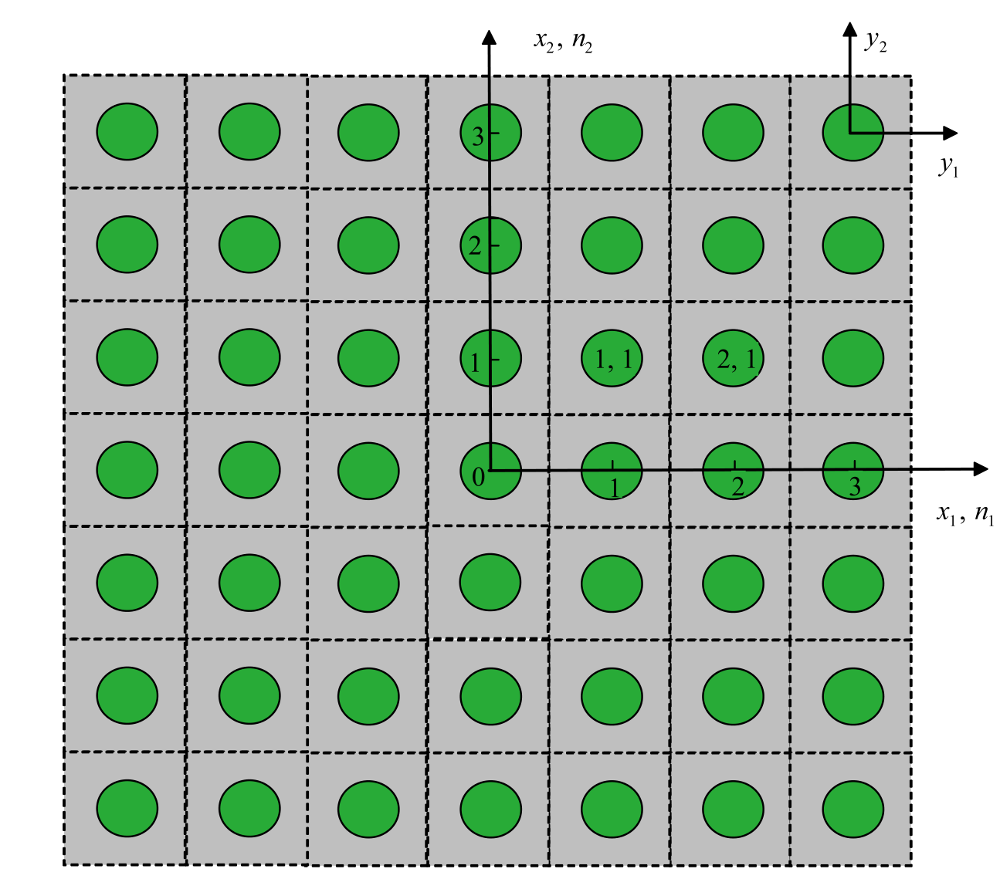

## AE 760AA: Micromechanics and multiscale modeling
Lecture 13 - SwiftComp

Dr. Nicholas Smith

Wichita State University, Department of Aerospace Engineering

22 March 2022

----
## schedule

-   22 Mar - SwiftComp
-   24 Mar - Fourier Analysis, HW 5 Due, Project Abstract Due
-   29 Mar - Method of Cells
-   31 Mar - Workday

----
## outline

<!-- TOC START min:1 max:1 link:false update:true -->
- variational asymptotic method 
- swiftcomp
- asymptotic homogenization 
- moose

<!-- TOC END -->

---
# variational asymptotic method 

----
## variational asymptotic method 

- For more details see the paper:
- Variational asymptotic method for unit cell homogenization of periodically heterogeneous materials
- Wenbin Yu, Tian Tang

----
## assumptions

- exact solutions of field variables have volume averages over the unit cell 

`$$ v_i = \frac{1}{\Omega} \int_\Omega u_i d\Omega \equiv \langle u_i \rangle $$`

- effective material properties of the unit cell are independent of geometry, boundary conditions, and loading
- homogenization is also only appropriate when `$h/l \ll 1$` where `$h$` is the characteristic size of the unit cell and `$l$` is the characteristic wavelength of deformation 

----
## variational statement 

----
## variational statement 

- coordinates are set up as shown, with two sets of cartesian coordinates and one set of integer coordinates
- `$x_i$` denote the global coordinate system
- `$y_i$` denote the local coordinate system
- `$n_i$` denote each individual unit cell

----
## variational statement 

- since any geometry would produce the same effective stiffness, this work considers an infinite space covered by periodic repititions of the unit cell 
- for an elastic material, the total potential energy is given as 

`$$ \Pi = \sum_{n=-\infty}^\infty \int_\Omega \frac{1}{2} C_{ijkl} (y_1, y_2, y_3) \epsilon_{ij} \epsilon_{kl} d\Omega $$`

----
## periodicity 

- the strain field in each unit cell is related to the displacement 
- displacements in adjacent unit cells must be continuous, for example 

`$$ u_i (n_1, n_2, n_3; d_1/2, y_2, y_3) = u_i (n_1 +1, n_2, n_3; -d_1/2, y_2, y_3)$$`

- this constraint can be imposed in the other two directions as well 
- using the lagrange multiplier technique, these constraints can be included in a functional with the total potential energy 

----
## substitution 

- it is convenient to write 

`$$ u_i (x_i; y_i) = v_i(x_i) + w_i(x_i; y_i)$$`

- where `$\langle w_i \rangle = 0$`
- a further substitution is convenient for the solution 

`$$ w_i (x_i; y_i) = y_j \frac{\partial v_i}{\partial x_j} + \chi(x_i; y_j) $$`

----
## implementation

- There are more details in the paper as well as some applications and results
- This is the method used by SwiftComp 

---
# swiftcomp

----
## swiftcomp

-   SwiftComp is a software built on the Variational Asymptotic Method, applied in particular to composites
-   You are not required to use SwiftComp in your project (we will also discuss Fourier and Method of Cells methods), but it may be the easiest
-   SwiftComp itself is a command-line tool, but Dr. Yu has merged it with a couple other software tools to give some form of GUI
-   gmsh4sc - modifies gmesh to work build mesh for SwiftComp, runs SwiftComp from the gmesh gui
-   texgen4sc - uses a textile software (for composite weaves) and runs swiftcomp from the texgen gui
-   plugins for Ansys and ABAQUS - if you use either of these software programs, you can run Swiftcomp from them as a plugin

----
## swiftcomp

-   SwiftComp can either be run in the cloud or downloaded to run locally
-   Right now Dr. Yu only has the linux executables for download, I contacted him to get the Windows files
-   We will run through a few demos, but before we get lost in some of the software details, it is important to remember the big picture

----
## micromechanics

-   In micromechanics, we are trying to represent a periodic structure with some effective property
-   For example, if we have a beam with a very complex cross-section, we can calculate the inertia of that cross-section and then model the beam as a straight line
-   We may, however, need to know the local stresses at certain points in the beam, the ability to recover local stresses is what SwiftComp calls "dehomogenization"

----
## workflow

-   Thus the general workflow in Swiftcomp is
    1.  Run SwiftComp to homogenize some unit cell (beam cross-section, fiber weave, etc.)
    2.  Run FEA to get displacements/stresses using homogenized stiffness
    3.  Run SwiftComp with FEA displacement/stress data to find the local stresses

----
## links

-   You should be able to run SwiftComp in the cloud (requires an account at cdmhub.org)
-   For [gmesh](https://cdmhub.org/tools/scstandard) (arbitrary shapes)
-   For [texgen](https://cdmhub.org/tools/texgen4sc/) (woven composites)

---
# asymptotic homogenization 

----
## asymptotic homogenization 

- another technique, which does not use variational calculus, is described in:
- Asymptotic homogenisation in linear elasticity. Part I: Mathematical
formulation and finite element modelling
- J. Pinho-da-Cruz, J.A. Oliveira, F. Teixeira-Dias
- This approach is implemented in the open-source [MOOSE framework](https://mooseframework.inl.gov/)

----
## asymptotic homogenization

- the displacement field solution to an elasticity solution is approximated by asymptotic expansion

`$$ u_i^\epsilon (x) = u_i^{(0)}(x,y) + \epsilon u_i^{(1)}(x,y) + \epsilon^2 u_i^{(2)}(x,y) $$`

such that 

`$$ \varepsilon_{ij}^{(0)} = \frac{1}{2} \left( \frac{\partial u_i^{(0)}}{\partial y_j} + \frac{\partial u_j^{(0)}}{\partial y_i} \right) $$`
`$$ \varepsilon_{ij}^{(r)} = \frac{1}{2} \left( \frac{\partial u_i^{(r-1)}}{\partial x_j} + \frac{\partial u_j^{(r-1)}}{\partial x_i} + \frac{\partial u_i^{(r)}}{\partial y_j} + \frac{\partial u_j^{(r)}}{\partial y_i} \right) $$`

----
## first-order

- When `$\epsilon \ll 1$` a first-order expansion is often sufficient, which simplifies the homogenization and localization
- The homogenized stiffness can be found as 

`$$ C_{ijmn}^H = \frac{1}{|Y|} \int_Y C_{ijkl} (y) \left [ \delta_{km}\delta_{ln} - \frac{\partial \chi_k^{mn}}{\partial y_i}\right] $$`

- And localized stresses and strains can be found as 

`$$ \sigma_{ij}^{(1)} (x,y) = C_{ijkl}(y) \left( \delta_{km}\delta_{ln} - \frac{\partial \chi_k^{mn}}{\partial y_i} \right) \frac{\partial u_m^{(0)}}{\partial x_n} $$`

---
# MOOSE 

----
## moose framework

- Asymptotic expansion homogenization is built-in to the open-source MOOSE framework 
- Although installing it locally can be a little bit tricky, this might be easier than fussing with the cloud-based SwiftComp implementation, and I am personally interested in comparing results from the two methodologies
- Another advantage to the MOOSE AEH approach is that a multi-scale model can be done simultaneously (compared to SwiftComp, where you would input a stiffness into some other FEA code, then take those stresses/strains and input them for a localization study)

----
## installation 

- MOOSE now provides Docker containers, this is probably the easiest way to get started
- Will essentially install a virtual linux environment with the source code already set up and compiled
- Install [Docker Desktop](https://www.docker.com/get-started/) for your environment 
- After the installation has completed, you can download, install, and run initial tests by typing

`docker run -ti idaholab/moose:latest /bin/bash -c 'cd test; ./run_tests'`

Into a terminal
